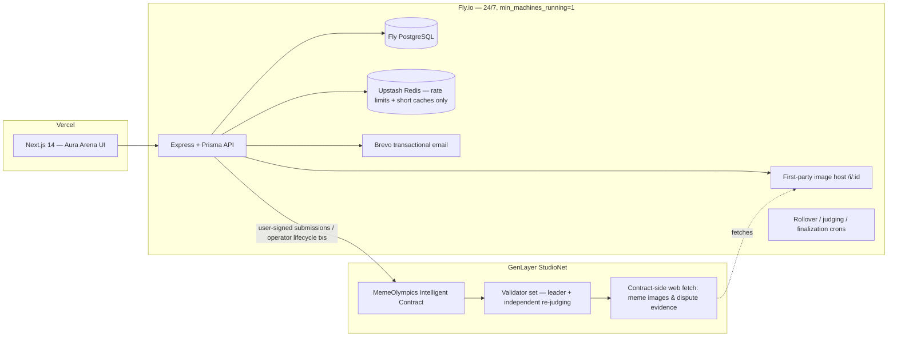
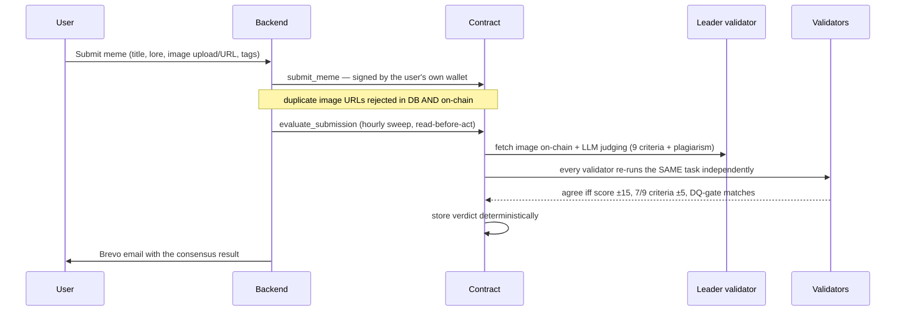

# 🏆 Meme Olympics

**Weekly crypto meme competitions judged by GenLayer Intelligent Contract
validator consensus — not likes, not votes, only logic.**

- **Live app:** https://meme-olympics.vercel.app
- **API:** https://meme-olympics-api.fly.dev (Fly.io, always-on)
- **Intelligent Contract (StudioNet):** `0xC31D62f39916b99d9f2fE036351898407E0C9224`

Users submit crypto memes to competition "arenas" — the weekly official one or
arenas **anyone can host**. Each submission is registered on-chain (signed by
the user's own custodial wallet), then judged by GenLayer validators across
nine weighted, reasoning-based criteria with a plagiarism/recycled-content
assessment. Winners, rewards and disputes all settle on-chain.

## Why GenLayer (the consensus boundary)

| Owner | Responsibility |
|---|---|
| **Contract** ([contracts/meme_olympics.py](contracts/meme_olympics.py)) | Competition lifecycle, submission registry, AI judging under validator consensus, plagiarism gate, deterministic winner selection & rewards, evidence-based disputes with contract-side web fetching |
| **Backend** ([backend/](backend/)) | Auth + custodial wallets, first-party image hosting, lifecycle crons, Brevo notifications, rate limits/caching, off-chain mirror of chain state |
| **Frontend** ([frontend/](frontend/)) | Landing, arena, hosting, submission flow, consensus reports, disputes, leaderboards, rewards, settings, admin |

Deciding which meme wins reward points is a subjective, appealable judgment —
exactly what needs independent validator verification. **Validators never
accept leader output on format alone**: every validator independently re-runs
the judging task and compares substantive decision fields with explicit
tolerances (total score ±15/100, 7-of-9 criteria within ±5, hard agreement
gate on plagiarism disqualification). Tolerant enough to avoid rotation loops
and UNDETERMINED results, strict enough to catch a dishonest leader.

## Architecture



### Judging flow



## Product features

- **Email + password auth** with an auto-created EVM wallet permanently linked
  to the account (AES-256-GCM encrypted at rest) — survives device changes,
  browser resets and reinstalls; private key exportable after a fresh password
  check. Password reset via Brevo (hashed single-use tokens, 30-min expiry).
- **Open competition hosting** — any signed-in user can create an arena
  (title, theme brief for the judges, deadline) from the Arena page. Multiple
  arenas run concurrently; a "Choose your arena" selector on Submit lists every
  open one. Anti-spam: 3/day per account off-chain, 5 per account on-chain.
- **First-party image hosting** — memes can be uploaded directly (PNG/JPG/GIF/
  WebP, ≤3MB) and are served from the backend's own always-on `/i/:id`
  endpoint, so validator image fetches never get blocked by a flaky
  third-party host. Pasting a public URL is still supported.
- **Meme submission** — 3-step flow (asset → context/lore/tags → pre-flight),
  capped at 3 entries per user per arena; the contract re-verifies every rule.
- **Consensus reports** — every meme card across the site (Arena, Leaderboard,
  Dashboard) links to `/meme/:id`: full 9-criteria breakdown with on-chain
  weights, plagiarism verdict + confidence, the validators' written judging
  summary, and the registration tx hash.
- **Disputes** — a "⚔ Challenge This Meme" button on every judged report;
  challengers must supply a public evidence URL, which the contract fetches
  **on-chain** and rules on — auto-rejected if the evidence can't be fetched.
  Facts are never judged from user-submitted text alone.
- **Leaderboards** — Hall of Glory podium + detailed rankings per arena.
- **Rewards** — 1,000-point weekly pool split 50/30/20, settled on-chain to
  winner wallets, automatically clawed back if a plagiarism dispute is upheld.
- **Live proof on the landing page** — a pulsing link to a real, currently
  judged meme's consensus report, so anyone can verify the judging is real
  before signing up.
- **Notifications** — Brevo emails for welcome, judging results and wins.
- **Admin panel** — stats, manual rollover/judging triggers, dispute
  resolution, submission maintenance.

## Intelligent contract design notes

- Pinned GenVM runner (`py-genlayer:1jb45…`); no `test`/`latest` aliases.
- Storage per GenLayer rules: class-level annotations, `TreeMap`/`DynArray`,
  `u256` atto-scale rewards, JSON-string serialization for nested data,
  append-only layout.
- Custom validator functions via `gl.vm.run_nondet_unsafe`; error taxonomy
  `[EXPECTED] [EXTERNAL] [TRANSIENT] [LLM_ERROR]` so even failure paths reach
  consensus deterministically.
- The constructor accepts an optional `owner_address` (RPC deploy paths can
  present a zero sender).
- `gl.message.sender_address` is the correct sender accessor on current GenVM.

## Operational reliability (learned the hard way, all handled)

- **Duplicate-action safety** — judging is read-before-act: the sweep reads
  on-chain state first and only sends an evaluate tx for genuinely un-judged
  submissions; already-processed ones sync without any transaction. After
  evaluating it polls until the settled state is readable, so stale
  "pending" reads are never written back. Duplicate submissions are blocked
  in the UI, the DB (409 on same image URL) and the contract.
- **Accepted ≠ succeeded** — a GenLayer tx can be consensus-ACCEPTED while
  its execution rolled back. The backend inspects the **leader receipt's**
  `execution_result` (idle-validator ERROR records are ignored) and decodes
  the base64 leader result for the real `[EXPECTED] …` message.
- **genlayer-js quirks** — ESM-only (loaded via dynamic import), reads return
  `Map`s (normalized recursively), deployment address lives at
  `receipt.data.contract_address`, StudioNet = localnet chain shape + hosted
  endpoint.
- **Redis frugality, verified in production** — every Redis touch lives in
  [backend/src/lib/redis.ts](backend/src/lib/redis.ts): a single lazy
  connection, one `INCR` (+ `EXPIRE` only on the first hit) per rate-limited
  request, 60–120s TTL caches on the handful of hot read endpoints
  (leaderboard, active competition), and it fails open — if Upstash is ever
  unreachable, requests proceed unthrottled instead of erroring. There is no
  polling, no keyspace scanning, no pub/sub. Public GET routes (contract
  reads, meme detail, arena lists) don't touch Redis at all.
- **24/7 backend, verified in production** — `auto_stop_machines=false`,
  `min_machines_running=1`, a DB-checked `/health` endpoint Fly polls every
  30s, process-level `uncaughtException`/`unhandledRejection` guards that log
  and keep running instead of crashing, and a GitHub Actions workflow
  ([.github/workflows/uptime.yml](.github/workflows/uptime.yml)) pinging both
  the API and frontend every 15 minutes with an auto-filed GitHub issue on
  failure. Rows that never reached the chain are auto-failed after 30 minutes
  instead of retrying forever.

## Automation (UTC)

| When | What |
|---|---|
| Mon 00:05 | Weekly rollover — expired arenas → judging, new `week-YYYY-WW` opens on-chain |
| Hourly :15 | Judging sweep — up to 10 un-judged submissions evaluated under consensus |
| Hourly :45 | Finalization — fully-judged arenas finalize; winners emailed |
| Every 15 min | Uptime check (GitHub Actions) — API `/health` + frontend |

## Repository layout

```
contracts/meme_olympics.py   # ~1,700-line GenLayer Intelligent Contract
backend/                     # Node 20 + TS + Express + Prisma + Redis + Brevo (Fly.io)
frontend/                    # Next.js 14 + Tailwind, Aura Arena design system (Vercel)
.github/workflows/uptime.yml # 15-min health check with auto-filed issues
MEMORY.md                    # living project memory
```

## Running locally

```bash
# 1. Postgres
docker run -d --name mo-pg -e POSTGRES_PASSWORD=postgres \
  -e POSTGRES_DB=meme_olympics -p 5432:5432 postgres:16

# 2. Backend
cd backend && cp .env.example .env   # fill secrets (see file comments)
npm install && npx prisma migrate dev && npm run dev   # :8080

# 3. Frontend
cd ../frontend && npm install
NEXT_PUBLIC_API_URL=http://localhost:8080 npm run dev  # :3000
```

## Deploying

- **Contract**: paste `contracts/meme_olympics.py` into
  [GenLayer Studio](https://studio.genlayer.com) and deploy (optionally pass
  `owner_address`). Update `GENLAYER_CONTRACT_ADDRESS`.
- **Backend**: `cd backend && fly deploy` (secrets via `fly secrets set`, see
  [.env.example](backend/.env.example)).
- **Frontend**: `cd frontend && vercel --prod` with `NEXT_PUBLIC_API_URL`.
- To enable automatic on-chain finalization, the contract owner calls
  `add_admin(<backend operator address>)` once from Studio.

## Known open item

On-chain **finalization** (winner selection + reward settlement) is
admin-gated on the contract. The backend's operator wallet is not yet an
admin on the current deployment — until the contract owner runs
`add_admin(<backend operator address>)` once in Studio, memes are judged and
ranked but reward points are not settled on-chain and winner emails don't
fire. Everything else in the pipeline (auth, hosting, submission, judging,
leaderboards, disputes, consensus reports) is fully live.

## Security

bcrypt(12) passwords · JWT sessions · single-use hashed reset tokens ·
AES-256-GCM wallet keys with password-gated export · per-route rate limits ·
helmet + strict CORS · enumeration-safe reset flow · no secrets in the repo.
