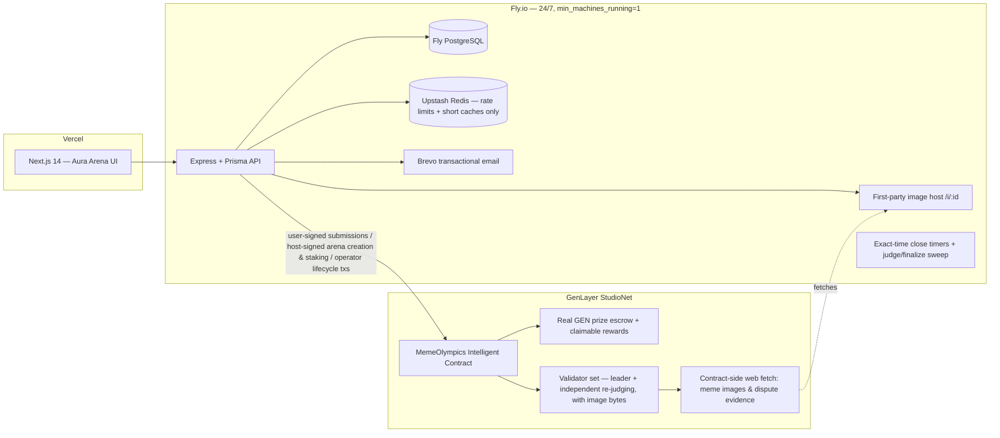
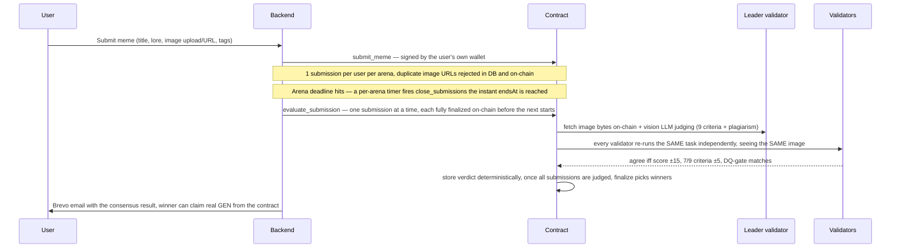

# 🏆 Meme Olympics

**Crypto meme competitions with real GEN prize pools, judged by GenLayer
Intelligent Contract validator consensus — not likes, not votes, only logic.**

- **Live app:** https://meme-olympics.vercel.app
- **API:** https://meme-olympics-api-prod.fly.dev (Fly.io, always-on)
- **Intelligent Contract (StudioNet):** `0xa1439a103Ff8b1eBfa13Ea95626E2fA269e8F016`

Anyone can host an arena — set a theme, a deadline, and a real GEN prize pool
staked from their own wallet at creation. Anyone can submit one meme per
arena, registered on-chain and signed by the submitter's own custodial
wallet. When an arena's deadline hits, GenLayer validators judge every
submission — genuinely seeing the image, not just its URL — across nine
weighted, reasoning-based criteria plus a visual plagiarism check. Winners
are picked deterministically on-chain and can claim their real GEN reward
straight into their wallet.

## Why GenLayer (the consensus boundary)

| Owner | Responsibility |
|---|---|
| **Contract** ([contracts/meme_olympics.py](contracts/meme_olympics.py)) | Competition lifecycle, real GEN escrow + claimable rewards, submission registry, vision-based AI judging under validator consensus, plagiarism gate, deterministic winner selection, evidence-based disputes with contract-side web fetching |
| **Backend** ([backend/](backend/)) | Auth + custodial wallets, first-party image hosting, exact-time lifecycle scheduling, Brevo notifications, rate limits/caching, off-chain mirror of chain state |
| **Frontend** ([frontend/](frontend/)) | Landing, arena browsing + detail, hosting, submission flow, consensus reports, disputes, leaderboards, GEN balance + rewards, settings, admin |

Deciding which meme wins a real prize pool is a subjective, appealable
judgment — exactly what needs independent validator verification.
**Validators never accept leader output on format alone**: every validator
independently re-runs the judging task (including looking at the same image
bytes) and compares substantive decision fields with explicit tolerances
(total score ±15/100, 7-of-9 criteria within ±5, hard agreement gate on
plagiarism disqualification). Tolerant enough to avoid rotation loops and
UNDETERMINED results, strict enough to catch a dishonest leader.

## Architecture



### Judging flow



## Product features

- **Email + password auth** with an auto-created EVM wallet permanently linked
  to the account (AES-256-GCM encrypted at rest) — survives device changes,
  browser resets and reinstalls; private key exportable after a fresh password
  check. Password reset via Brevo (hashed single-use tokens, 30-min expiry).
- **Open competition hosting, real stakes** — any signed-in user can create an
  arena (title, theme brief for the judges, deadline, optional GEN prize pool)
  from their own wallet — a genuine on-chain value transfer, not backend-paid.
  Anyone can top up an existing arena's pool. Anti-spam: 3 arena creations/day
  per account (backend), separate submission rate limits.
- **Browse arenas** — `/arenas` lists every arena (open / judging / finalized)
  with live countdowns, entry counts and staked prize; `/arenas/:id` shows
  full detail (theme, deadline, real prize, winners once finalized, a plain
  explanation of how judging works) before jumping into submission or the
  leaderboard.
- **First-party image hosting** — memes can be uploaded directly (PNG/JPG/GIF/
  WebP, ≤3MB) and are served from the backend's own always-on `/i/:id`
  endpoint, so validator image fetches never get blocked by a flaky
  third-party host. Pasting a public URL is still supported.
- **Meme submission** — 3-step flow (asset → context/lore/tags → pre-flight),
  capped at **1 entry per user per arena** on both the backend and the
  contract; deep-linkable via `/submit?arena=<id>`.
- **Vision-based judging** — the contract doesn't just read the image URL, it
  fetches the actual image bytes and passes them into the judging LLM as
  genuine visual input, so scoring and the plagiarism check (watermarks,
  screenshot chrome, pixel-identical duplicates) reason from what's actually
  depicted, with a text-only fallback if a fetch ever fails.
- **Strictly sequential judging** — submissions are evaluated one at a time;
  a submission is fully finalized on-chain before the next one is even sent,
  by design (large arenas judge over hours, not race through a batch).
- **Exact-time deadlines** — each arena gets its own timer armed the instant
  it's created (and re-armed for every open arena on backend restart), so
  its close fires within ~1-2 seconds of the deadline — independent of how
  long any other arena's judging run is taking. A per-minute sweep is kept
  only as a fallback for a timer lost to a restart.
- **Consensus reports** — every meme card across the site (Arena, Leaderboard,
  Dashboard) links to `/meme/:id`: full 9-criteria breakdown with on-chain
  weights, plagiarism verdict + confidence, the validators' written judging
  summary, and the registration tx hash.
- **Disputes** — a "⚔ Challenge This Meme" button on every judged report;
  challengers must supply a public evidence URL, which the contract fetches
  **on-chain** and rules on — auto-rejected if the evidence can't be fetched.
  Facts are never judged from user-submitted text alone.
- **Leaderboards** — Hall of Glory podium + detailed rankings per arena.
- **Real GEN rewards, self-claimed** — winners are picked deterministically
  from the judged scores and their share of the arena's staked GEN becomes
  claimable from the contract into their own wallet (not auto-pushed), backed
  by a genuine on-chain value transfer via an EVM-interface transfer helper
  (the native `get_contract_at`/`emit_transfer` path only works
  contract-to-contract, not against plain wallets — confirmed the hard way).
- **GEN balance dashboard** — both the Rewards page (with a one-click claim)
  and the Settings/profile page show a user's real, spendable wallet GEN
  balance alongside their claimable escrow balance, polling every 10s.
- **Live proof on the landing page** — a pulsing link to a real, currently
  judged meme's consensus report, so anyone can verify the judging is real
  before signing up.
- **Notifications** — Brevo emails for welcome, judging results and wins.
- **Admin panel** — stats, manual rollover/judging triggers, dispute
  resolution, submission maintenance.
- **Live status without a manual reload** — submission status, scores and
  reward balances auto-poll on Dashboard, Leaderboard, Rewards, Settings,
  Arena and meme-detail pages.

## Intelligent contract design notes

- Pinned GenVM runner (`py-genlayer:1jb45…`); no `test`/`latest` aliases.
- Storage per GenLayer rules: class-level annotations, `TreeMap`/`DynArray`,
  `u256` atto-scale values, JSON-string serialization for nested data,
  append-only layout.
- Custom validator functions via `gl.vm.run_nondet_unsafe`; error taxonomy
  `[EXPECTED] [EXTERNAL] [TRANSIENT] [LLM_ERROR]` so even failure paths reach
  consensus deterministically.
- Real GEN value transfer to plain EOA wallets goes through a
  `@gl.evm.contract_interface` stub, **not** `gl.get_contract_at(...).emit_transfer(...)`
  — the latter only resolves against an address with deployed contract code
  and fails with "Contract not found" against an ordinary wallet, proven via
  live control tests before shipping.
- Vision input to `gl.nondet.exec_prompt` is the `images` kwarg (plural,
  list of raw bytes) regardless of `response_format` — the runtime's own
  type stubs inconsistently advertise a singular `image=` for JSON mode,
  which is silently a no-op; confirmed against the actual pinned runner.
- The constructor accepts an optional `owner_address` (RPC deploy paths can
  present a zero sender); a `claim_initial_owner()` bootstrap exists for
  that path but isn't needed when deploying via the Studio UI.
- `gl.message.sender_address` is the correct sender accessor on current GenVM.

## Operational reliability (learned the hard way, all handled)

- **Authoritative on-chain lifecycle** — nothing user-visible is persisted
  ahead of a confirmed contract write. Competition creation (both user-hosted
  and admin-created) deletes the DB row if `create_competition`/
  `open_competition` fails rather than leaving an orphaned "open" arena with
  no path to close or finalize. Disputes only flip `onchainOpened: true`
  once `openDisputeOnChain` actually succeeds — the flag that
  `retryDisputeRegistrationSweep` checks before retrying, so a
  never-confirmed open no longer causes duplicate on-chain writes forever.
  Deadlines are enforced twice: `runJudgingSweep` never evaluates a
  submission until its competition is already `judging` **and** `endsAt`
  has passed, and the submission route itself rejects new entries the
  moment `endsAt` passes even in the narrow window before the close timer
  fires. Four independent retry sweeps
  (`retryOnchainCreationSweep`, `retrySubmissionRegistrationSweep`,
  `retryDisputeRegistrationSweep`, `runFinalization`) run every tick in
  [`weekly.ts`](backend/src/jobs/weekly.ts) to reconcile anything a failed
  chain call left stuck. See [REVIEW.md](REVIEW.md) for the full writeup.
- **Duplicate-action safety** — judging is read-before-act: the sweep reads
  on-chain state first and only sends an evaluate tx for genuinely un-judged
  submissions; already-processed ones sync without any transaction. After
  evaluating it polls until the settled state is readable, so stale
  "pending" reads are never written back. Duplicate submissions are blocked
  in the UI, the DB (409 on same image URL, 1-per-user-per-arena cap) and
  the contract.
- **Accepted ≠ succeeded** — a GenLayer tx can be consensus-ACCEPTED while
  its execution rolled back. The backend inspects the **leader receipt's**
  `execution_result` (idle-validator ERROR records are ignored) and decodes
  the base64 leader result for the real `[EXPECTED] …` message.
- **Read-after-write lag** — reads immediately following a write (finalize
  winners, claim balance, contract-defaults update) can return pre-write
  state; the backend polls (`readSettled`, `waitForWalletIncrease`) until a
  read actually reflects the write before trusting or caching it.
- **Deadline close is never blocked by judging** — closing an arena (status
  flip + one fast on-chain call) and judging/finalizing (potentially
  hours-long under strict sequential evaluation) run on independent
  single-flight guards, so one arena's slow judging run can never leave a
  different, already-expired arena stuck open and still accepting
  submissions.
- **genlayer-js quirks** — ESM-only (loaded via dynamic import), reads return
  `Map`s (normalized recursively), deployment address lives at
  `receipt.data.contract_address`, StudioNet = localnet chain shape + hosted
  endpoint.
- **Redis frugality, verified in production** — every Redis touch lives in
  [backend/src/lib/redis.ts](backend/src/lib/redis.ts): a single lazy
  connection, one `INCR` (+ `EXPIRE` only on the first hit) per rate-limited
  request, 60–120s TTL caches on the handful of hot read endpoints
  (leaderboard, active competition), and it fails open — if Upstash is ever
  unreachable, requests proceed unthrottled instead of erroring. There is no
  polling, no keyspace scanning, no pub/sub. Public GET routes (contract
  reads, meme detail, arena lists) don't touch Redis at all.
- **24/7 backend, verified in production** — `auto_stop_machines=false`,
  `min_machines_running=1`, a DB-checked `/health` endpoint Fly polls every
  30s, process-level `uncaughtException`/`unhandledRejection` guards that log
  and keep running instead of crashing, and a GitHub Actions workflow
  ([.github/workflows/uptime.yml](.github/workflows/uptime.yml)) pinging both
  the API and frontend every 15 minutes with an auto-filed GitHub issue on
  failure. Rows that never reached the chain are auto-failed after 30 minutes
  instead of retrying forever.

## Frontend performance

The app shell (Vercel) and all data (Fly API) are on separate origins, so
the browser doesn't open a connection to the API until the first fetch
fires — that's the "page loads instantly, details lag a beat" pattern.
Addressed with:

- A `preconnect`/`dns-prefetch` hint to the API origin in the root layout,
  so that connection opens in parallel with page render instead of only on
  the first data request.
- `GET /api/competitions/:id` (the Arena Detail page's heaviest-hit read —
  page load + every poll tick) now carries the same 15–120s Redis cache
  its sibling endpoints (list/active/leaderboard) already had.
- Real loading states instead of a misleading empty state (e.g. Dashboard
  no longer renders "No entries yet" while the first fetch is still in
  flight).

## Automation (UTC)

| When | What |
|---|---|
| Mon 00:05 | Weekly rollover — opens the new official `week-YYYY-WW` arena on-chain |
| Exact deadline | Per-arena timer closes that arena the instant its deadline hits (armed at creation, re-armed for all open arenas on backend restart) |
| Every minute | Fallback close sweep (catches a timer lost to a restart) + judge sweep (judges up to 10 pending submissions, one arena's worth at a time) + finalization sweep |
| Every 15 min | Uptime check (GitHub Actions) — API `/health` + frontend |

## Repository layout

```
contracts/meme_olympics.py   # ~1,900-line GenLayer Intelligent Contract
backend/                     # Node 20 + TS + Express + Prisma + Redis + Brevo (Fly.io)
frontend/                    # Next.js 14 + Tailwind, Aura Arena design system (Vercel)
.github/workflows/uptime.yml # 15-min health check with auto-filed issues
MEMORY.md                    # living project memory
```

## Running locally

```bash
# 1. Postgres
docker run -d --name mo-pg -e POSTGRES_PASSWORD=postgres \
  -e POSTGRES_DB=meme_olympics -p 5432:5432 postgres:16

# 2. Backend
cd backend && cp .env.example .env   # fill secrets (see file comments)
npm install && npx prisma migrate dev && npm run dev   # :8080

# 3. Frontend
cd ../frontend && npm install
NEXT_PUBLIC_API_URL=http://localhost:8080 npm run dev  # :3000
```

## Testing

```bash
cd backend && npm test   # vitest — 24 tests, in-memory fake Prisma + fake GenLayer service
```

Covers the payout-critical lifecycle: no early close/scoring before a
deadline, orphan-safe competition creation, idempotent close, on-chain
creation/submission/dispute retry sweeps, no partial or early payout while
submissions are still unprocessed, and payout only recorded once finalize
is on-chain confirmed. See [REVIEW.md](REVIEW.md) for what each test
guards against.

## Deploying

- **Contract**: paste `contracts/meme_olympics.py` into
  [GenLayer Studio](https://studio.genlayer.com) and deploy (optionally pass
  `owner_address`). Update `GENLAYER_CONTRACT_ADDRESS`. The contract owner
  then calls `add_admin(<backend operator address>)` once from Studio so the
  backend can close/judge/finalize arenas it didn't itself create.
- **Backend**: `cd backend && fly deploy --ha=false` (secrets via
  `fly secrets set`, see [.env.example](backend/.env.example)).
- **Frontend**: `cd frontend && vercel --prod` with `NEXT_PUBLIC_API_URL`.

## Security

bcrypt(12) passwords · JWT sessions · single-use hashed reset tokens ·
AES-256-GCM wallet keys with password-gated export · per-route rate limits ·
helmet + strict CORS · enumeration-safe reset flow · no secrets in the repo.
