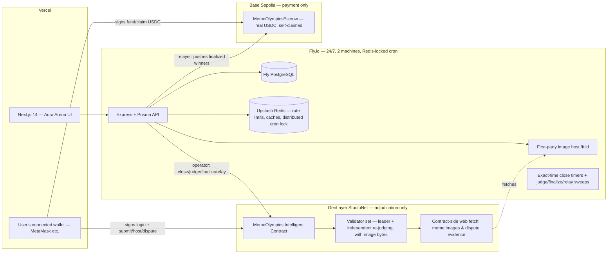
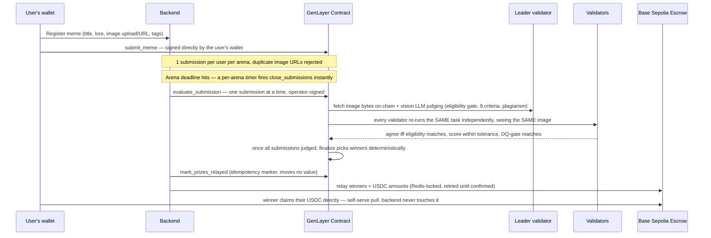

# 🏆 Meme Olympics

**Crypto meme competitions judged by GenLayer validator consensus, paid out
in real USDC on Base Sepolia — not likes, not votes, only logic.**

- **Live app:** https://meme-olympics.vercel.app
- **API:** https://meme-olympics-api-prod.fly.dev (Fly.io, 24/7, 2 machines)
- **GenLayer Intelligent Contract (StudioNet):** `0xB943Eefa3e43E6FBf68eE14F0668D88f97eabaE4`
- **MemeOlympicsEscrow (Base Sepolia):** `0x76128b04627b80D8E556568cc7fA7cb0eaf035Fe`
- **USDC (Base Sepolia, Circle official):** `0x036CbD53842c5426634e7929541eC2318f3dCF7e`

Anyone can host an arena — set a theme, a deadline, and an optional real
USDC prize pool. Anyone can submit one meme per arena. When an arena's
deadline hits, GenLayer validators judge every submission — genuinely
seeing the image, not just its URL — across nine weighted, reasoning-based
criteria, a hard eligibility gate, and a visual plagiarism check. Winners
are picked deterministically on-chain; the payout settles separately on
Base Sepolia, self-claimed straight into the winner's own wallet.

There is **one wallet, one signer, for everything**: connecting it is how
you log in (sign a free message, no password), it's what signs every
GenLayer write (submit/host/dispute), and it's what funds/claims USDC on
Base Sepolia. No email, no custodial key, nothing held on your behalf.

## Why two chains

| Layer | Responsibility |
|---|---|
| **GenLayer** ([contracts/meme_olympics.py](contracts/meme_olympics.py)) | Adjudication only — competition lifecycle, submission registry, vision-based AI judging under validator consensus, hard eligibility gate, plagiarism gate, deterministic winner selection, evidence-based disputes. **Never holds or moves real value.** |
| **Base Sepolia** ([contracts/base/MemeOlympicsEscrow.sol](contracts/base/MemeOlympicsEscrow.sol)) | Payment only — real USDC prize pools, funded by hosts and claimed by winners, both as genuine on-chain value transfers signed by the user's own wallet. |
| **Backend** ([backend/](backend/)) | Wallet-signature auth (SIWE), off-chain mirror of chain state, exact-time lifecycle scheduling, relaying finalized winners from GenLayer to the Base Sepolia escrow, first-party image hosting, rate limits/caching. Holds no user keys at all. |
| **Frontend** ([frontend/](frontend/)) | Landing, arena browsing + hosting, submission flow, consensus reports with winner judging detail, disputes, leaderboards, USDC balances + rewards, settings (username, wallet info). |

GenLayer's own SDK can sign with an injected wallet (not just a raw private
key) when you pass it an address instead of a key — see
[frontend/src/lib/genlayer.ts](frontend/src/lib/genlayer.ts) — so GenLayer
writes are signed by the same connected wallet as everything else, with no
backend-held signer in between.

Deciding which meme wins a real prize pool is a subjective, appealable
judgment — exactly what needs independent validator verification.
**Validators never accept leader output on format alone**: every validator
independently re-runs the judging task (including looking at the same image
bytes) and compares substantive decision fields with explicit tolerances
(hard agreement gate on eligibility, hard agreement gate on plagiarism
disqualification with a confidence-delta check, total score within ±10/100,
8-of-9 criteria within ±3). Tolerant enough to avoid rotation loops and
UNDETERMINED results, strict enough to catch a dishonest leader.

## Architecture



### Judging + payout flow



## Product features

- **Wallet-connect auth, nothing else** — connect your wallet, sign a free
  message (no gas, no transaction) to prove ownership. First connect
  auto-creates your account. No email, no password, no custodial key
  anywhere — see [backend/src/routes/auth.ts](backend/src/routes/auth.ts).
- **Optional display name** — set a username from Settings once connected;
  purely cosmetic, shown instead of a shortened address on leaderboards,
  submissions and the dashboard. Login itself stays wallet-only.
- **Open competition hosting, real stakes** — any connected wallet can
  create an arena (title, theme brief for the judges, deadline, optional
  USDC prize pool). Both `create_competition` and `open_competition` are
  signed by the host's own wallet — the backend operator is never involved
  in creating or opening a user's own arena, only in things a host
  genuinely can't do themselves (judging, finalizing, disputes). If a
  prize pool is set, the host is walked through approve + deposit on the
  Base Sepolia escrow right after.
- **Browse arenas** — `/arenas` lists every arena (open / judging /
  finalized) with live countdowns, entry counts and staked prize;
  `/arenas/:id` shows full detail plus, once finalized, each winner's
  actual meme image, judging summary, per-criterion score breakdown and
  plagiarism verdict — not just an address and a number.
- **First-party image hosting** — memes can be uploaded directly (PNG/JPG/
  GIF/WebP, ≤3MB) and are served from the backend's own always-on
  `/i/:id` endpoint, so validator image fetches never get blocked by a
  flaky third-party host.
- **Meme submission** — 3-step flow (asset → context/lore/tags →
  pre-flight), capped at **1 entry per user per arena** on both the
  backend and the contract; the on-chain `submit_meme` call is signed
  directly by the submitter's wallet.
- **Hard eligibility gate** — before any criteria scoring happens, the
  judge decides whether a submission is even a real meme entry at all
  (not blank, not spam, not unrelated content). An ineligible entry scores
  0 regardless of what the per-axis numbers say, and both leader and
  validator must agree on eligibility or consensus fails — axes never
  rescue a disqualified submission.
- **Vision-based judging** — the contract fetches the actual image bytes
  and passes them into the judging LLM as genuine visual input, so scoring
  and the plagiarism check (watermarks, screenshot chrome, pixel-identical
  duplicates) reason from what's actually depicted, with a text-only
  fallback if a fetch ever fails.
- **Strictly sequential judging** — submissions are evaluated one at a
  time; a submission is fully finalized on-chain before the next one is
  even sent.
- **Exact-time deadlines** — each arena gets its own timer armed the
  instant it's created (and re-armed for every open arena on backend
  restart), so its close fires within ~1-2 seconds of the deadline. A
  per-minute sweep is kept only as a fallback for a timer lost to a
  restart.
- **Consensus reports** — every meme card links to `/meme/:id`: full
  9-criteria breakdown with on-chain weights, eligibility + plagiarism
  verdict with confidence, the validators' written judging summary, and
  the registration tx hash.
- **Disputes** — a "⚔ Challenge This Meme" button on every judged report;
  challengers must supply a public evidence URL, which the contract
  fetches **on-chain** and rules on. The `open_dispute` call is signed by
  the challenger's own wallet, same as submissions.
- **Leaderboards** — Hall of Glory podium + detailed rankings per arena.
- **Real USDC rewards, self-claimed** — GenLayer computes winners and USDC
  amounts owed as a pure judging record (no value moves there); the
  backend relays that result to MemeOlympicsEscrow on Base Sepolia, and
  winners pull their own USDC directly from the escrow contract with
  their own wallet. The backend never custodies a cent.
- **USDC balance dashboard** — Settings and Rewards both show your real
  wallet USDC balance on Base Sepolia, what you've won but isn't relayed
  yet, and what's actually claimable right now — tracked per-competition
  relay status, not inferred from a running total that never decrements
  (a bug we hit and fixed: see [milestone-v2.md](milestone-v2.md)).
- **Live status without a manual reload** — submission status, scores and
  balances auto-poll on Dashboard, Leaderboard, Rewards, Settings, Arena
  and meme-detail pages.
- **Admin panel** — stats, manual rollover/judging triggers, dispute
  resolution, submission maintenance. Admin is granted per-wallet
  (`ADMIN_WALLETS`), auto-applied on first connect.

## Intelligent contract design notes

- Pinned GenVM runner (`py-genlayer:1jb45…`); no `test`/`latest` aliases.
- Storage per GenLayer rules: class-level annotations, `TreeMap`/`DynArray`,
  `u256` values, JSON-string serialization for nested data, append-only
  layout — fields are only ever added, never removed or reordered, so a
  redeploy-free upgrade path stays possible.
- Custom validator functions via `gl.vm.run_nondet_unsafe`; error taxonomy
  `[EXPECTED] [EXTERNAL] [TRANSIENT] [LLM_ERROR]` so even failure paths
  reach consensus deterministically.
- **No value ever moves on GenLayer.** Prize money is real USDC on a
  separate chain (Base Sepolia); GenLayer only judges and records amounts
  owed. This replaced an earlier design that escrowed native GEN directly
  in the contract — dropped after review flagged GEN-denominated funding
  as impractical. See [milestone-v2.md](milestone-v2.md).
- Vision input to `gl.nondet.exec_prompt` is the `images` kwarg (plural,
  list of raw bytes) regardless of `response_format` — the runtime's own
  type stubs inconsistently advertise a singular `image=` for JSON mode,
  which is silently a no-op; confirmed against the actual pinned runner.
- The constructor accepts an optional `owner_address` (RPC deploy paths can
  present a zero sender); a `claim_initial_owner()` bootstrap exists for
  that path but isn't needed when deploying via the Studio UI. **After any
  redeploy, the new owner must call `add_admin(<operator address>)`** or
  every operator-signed action (judging, finalizing, relaying) fails with
  `Only admin may call this` — the exact bug this project hit twice.
- `gl.message.sender_address` is the correct sender accessor on current
  GenVM.

## Base Sepolia escrow design notes

See [contracts/base/README.md](contracts/base/README.md) for the full
funding/claim flow. Highlights:

- No external dependencies (no OpenZeppelin) — plain Solidity, ~200 lines,
  compiles with bare `solc`.
- `setWinners` is relayer-only and idempotent per competition — the
  contract itself refuses a second call for the same id, so the backend's
  retry sweep can't ever double-credit a payout.
- Claims are a pull pattern (`claim`/`claimMany`) with
  checks-effects-interactions and a reentrancy guard — the backend never
  holds or moves a winner's USDC.
- The owner can rotate the relayer and reclaim only *never-allocated*
  deposits — it can never touch anything already committed to a winner.

## Operational reliability (learned the hard way, all handled)

- **Authoritative on-chain lifecycle** — nothing user-visible is persisted
  ahead of a confirmed contract write. Competition creation deletes the DB
  row if the on-chain write never lands, rather than leaving an orphaned
  "open" arena with no path to close or finalize. Submissions, arena
  creation, and disputes all follow the same **register → wallet-signed
  write → confirm** pattern: the backend records a pending row, the
  frontend sends the wallet-signed transaction itself, then a
  `POST .../onchain-confirm` call reads GenLayer back to verify before
  flipping status — never trusting the client's word for it.
- **Read-after-write lag, handled with retries everywhere it bites** — a
  GenLayer read immediately after a write can return pre-write state. This
  hit the `onchain-confirm` endpoints hard enough to silently skip the USDC
  deposit step entirely (the read failed once, threw, and the deposit code
  after it in the same try block never ran) — fixed with `readUntilFound`,
  a retrying read (up to 6 attempts, 3s apart) used by all three
  `onchain-confirm` routes, alongside the existing `readSettled` used by
  the finalize/claim paths. See [milestone-v2.md](milestone-v2.md) for the
  full incident writeup.
- **Cross-machine cron safety** — this app runs 2 Fly machines for 24/7
  uptime, and each one fires the exact same in-process cron schedule
  independently. Without a lock, every tick (close/judge/relay/rollover)
  ran once *per machine* — a real bug that double-triggered on-chain
  writes in production. Fixed with a Redis-backed distributed lock
  ([`withLock`](backend/src/lib/redis.ts)) that self-renews for as long as
  a tick is running (judging can legitimately take minutes) and releases
  immediately on completion — see [milestone-v2.md](milestone-v2.md).
- **Duplicate-action safety** — judging is read-before-act: the sweep reads
  on-chain state first and only sends an evaluate tx for genuinely
  un-judged submissions. Duplicate submissions are blocked in the UI, the
  DB (409 on same image URL, 1-per-user-per-arena cap) and the contract.
- **Accepted ≠ succeeded** — a GenLayer tx can be consensus-ACCEPTED while
  its execution rolled back. The backend inspects the **leader receipt's**
  `execution_result` (idle-validator ERROR records are ignored) and
  decodes the base64 leader result for the real `[EXPECTED] …` message.
- **Deadline close is never blocked by judging** — closing an arena
  (status flip + one fast on-chain call) and judging/finalizing
  (potentially hours-long under strict sequential evaluation) run on
  independent single-flight guards (and independent Redis locks), so one
  arena's slow judging run can never leave a different, already-expired
  arena stuck open.
- **Prize relay decoupled from finalize** — relaying winners to the Base
  Sepolia escrow runs on its own sweep and its own lock, so a slow or
  stuck Base Sepolia RPC can never hold up judging or closing arenas.
- **genlayer-js quirks** — reads return `Map`s (normalized recursively),
  passing an address (not a private key) to `createClient` signs via the
  injected wallet provider instead of a raw local key, StudioNet = a fixed
  chain id (61999) pointed at the hosted Studio endpoint.
- **Redis frugality** — every Redis touch lives in
  [backend/src/lib/redis.ts](backend/src/lib/redis.ts): a single lazy
  connection, one `INCR` per rate-limited request, short-TTL caches on hot
  read endpoints, and a fail-open policy for both — if Upstash is
  unreachable, requests proceed unthrottled rather than erroring. The
  cross-machine cron lock fails **closed** (skip the tick) instead, since
  a missed tick self-heals next minute but a silently-unlocked tick
  reintroduces the double-trigger bug.
- **24/7 backend, verified in production** — `auto_stop_machines=false`,
  `min_machines_running=1`, scaled to 2 machines for redundancy, a
  DB-checked `/health` endpoint Fly polls every 30s, and a GitHub Actions
  workflow ([.github/workflows/uptime.yml](.github/workflows/uptime.yml))
  pinging both the API and frontend every 15 minutes with an auto-filed
  GitHub issue on failure.

## Automation (UTC)

| When | What |
|---|---|
| Mon 00:05 | Weekly rollover — opens the new official `week-YYYY-WW` arena on-chain (Redis-locked) |
| Exact deadline | Per-arena timer closes that arena the instant its deadline hits |
| Every minute | Fallback close sweep + judge/finalize sweep (both Redis-locked) |
| Every 2 min | Prize relay sweep — pushes any finalized-but-unrelayed competition's winners to the Base Sepolia escrow (Redis-locked) |
| Every 15 min | Uptime check (GitHub Actions) — API `/health` + frontend |

## Repository layout

```
contracts/meme_olympics.py       # GenLayer Intelligent Contract — adjudication only
contracts/base/
  MemeOlympicsEscrow.sol          # Base Sepolia — real USDC escrow + self-serve claims
  deploy.js                       # env-var-only deploy script (never hardcode a key)
backend/
  src/routes/                     # auth (SIWE), competitions, submissions, disputes, rewards, admin, uploads
  src/jobs/weekly.ts               # lifecycle scheduler + Redis-locked cron ticks
  src/services/genlayer.ts         # operator-only GenLayer calls (judging/finalize/relay-mark)
  src/services/baseSepolia.ts      # escrow relayer + reads
  src/lib/redis.ts                 # rate limiting, caching, distributed cron lock
frontend/
  src/lib/genlayer.ts               # GenLayer client signed by the connected wallet
  src/lib/baseSepolia.ts            # raw EIP-1193 wallet + Base Sepolia tx helpers
  src/app/                          # Next.js 14 App Router pages, Aura Arena design system
.github/workflows/uptime.yml       # 15-min health check with auto-filed issues
milestone-v2.md                    # this milestone's fixes/changes, written for team review
MEMORY.md                          # living project memory
```

## Running locally

```bash
# 1. Postgres
docker run -d --name mo-pg -e POSTGRES_PASSWORD=postgres \
  -e POSTGRES_DB=meme_olympics -p 5432:5432 postgres:16

# 2. Backend
cd backend && cp .env.example .env   # fill secrets (see file comments)
npm install && npx prisma migrate dev && npm run dev   # :8080

# 3. Frontend
cd ../frontend && npm install
NEXT_PUBLIC_API_URL=http://localhost:8080 npm run dev  # :3000
```

## Testing

```bash
cd backend && npm test   # vitest — 26 tests, in-memory fake Prisma + fake GenLayer service
```

Covers the payout-critical lifecycle: no early close/scoring before a
deadline, orphan-safe competition creation, the register → wallet-signed
write → confirm pattern for competitions/submissions/disputes (including
the "GenLayer doesn't confirm yet" 409 path), no partial or early payout
while submissions are still unprocessed, and payout only recorded once
finalize is on-chain confirmed.

## Deploying

- **GenLayer contract**: paste `contracts/meme_olympics.py` into
  [GenLayer Studio](https://studio.genlayer.com) and deploy. Update
  `GENLAYER_CONTRACT_ADDRESS`. **The new owner must then call
  `add_admin(<backend operator address>)`** — without this every
  operator-signed action (close/judge/finalize/relay) fails.
- **Base Sepolia escrow**: see
  [contracts/base/README.md](contracts/base/README.md) — `npm run
  deploy:escrow` from `backend/`, env vars only, never a literal key on
  the command line. Update `MEME_OLYMPICS_ESCROW_ADDRESS`.
- **Backend**: `cd backend && fly deploy` (secrets via `fly secrets set`,
  see [.env.example](backend/.env.example)). Runs `prisma migrate deploy`
  on boot automatically. Scaled to 2 machines
  (`fly scale count 2`) for 24/7 redundancy — safe because cron ticks are
  Redis-locked.
- **Frontend**: `cd frontend && vercel --prod` with `NEXT_PUBLIC_API_URL`
  and `NEXT_PUBLIC_GENLAYER_CONTRACT_ADDRESS`.

## Security

Wallet-signature auth (SIWE, single-use nonces) · JWT sessions · no
passwords, no email, no custodial keys anywhere in this app · per-route
rate limits · helmet + strict CORS · funds only ever move via the escrow
contract's own self-serve claim, signed by the winner · no secrets in the
repo.
