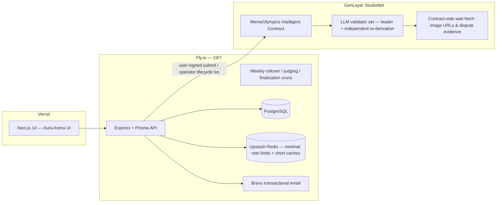
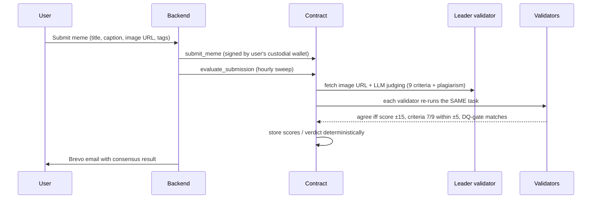

# 🏆 Meme Olympics

**Weekly crypto meme competitions judged by GenLayer Intelligent Contract
validator consensus — not likes, not votes, only logic.**

Every week, users submit crypto memes. A single production-grade GenLayer
Intelligent Contract evaluates each submission across nine weighted,
reasoning-based criteria (originality, humor, relevance, timing, irony,
cultural awareness, crypto-native understanding, contextual intelligence,
creativity), classifies plagiarism/recycled content, selects winners
deterministically, allocates rewards, and resolves disputes from web evidence
it fetches **on-chain**.

## Why GenLayer (the consensus boundary)

| Owner | Responsibility |
|---|---|
| **Contract** (`contracts/meme_olympics.py`) | Competition lifecycle, submission registry, AI judging under validator consensus, plagiarism gate, deterministic winner selection & rewards, evidence-based disputes |
| **Backend** (Fly.io, 24/7) | Auth + custodial wallets, orchestration crons, Brevo notifications, caching/rate limits, off-chain mirror of chain state |
| **Frontend** (Vercel) | Landing, arena, submission flow, leaderboards, rewards, settings, admin |

The judgment that decides who wins money-like rewards is exactly the kind of
subjective, appealable decision that needs independent validator verification —
validators **re-run the judging themselves** and compare decision fields with
explicit tolerances (score ±15/100, plagiarism hard gate, 7-of-9 criteria
within ±5). Validators never accept leader output on format alone.

## Architecture



### Judging flow



## Repository layout

```
contracts/meme_olympics.py   # ~1,700-line GenLayer Intelligent Contract
backend/                     # Node 20 + TS + Express + Prisma + Redis + Brevo
frontend/                    # Next.js 14 + Tailwind (Aura Arena design system)
MEMORY.md                    # living project memory
```

## Intelligent contract highlights

- Pinned runner header (`py-genlayer:1jb45…`) — required by all GenLayer networks.
- Storage per GenLayer rules: class-level annotations, `TreeMap`/`DynArray`,
  `u256` atto-scale rewards, JSON strings for nested structures, append-only layout.
- Custom validator functions (`gl.vm.run_nondet_unsafe`) with tolerant,
  substantive comparison — tuned to avoid unnecessary leader rotation and
  UNDETERMINED results while still catching dishonest leaders.
- Error taxonomy `[EXPECTED] [EXTERNAL] [TRANSIENT] [LLM_ERROR]` so failure
  paths also reach consensus.
- Disputes must cite a public evidence URL; the contract fetches it on-chain
  and auto-rejects when the evidence can't be fetched — facts are never judged
  from user-submitted text alone.
- Deterministic finalization: rank by score (id tiebreak), 50/30/20 pool split,
  automatic reward claw-back if a plagiarism dispute is upheld against a winner.

## Running locally

```bash
# 1. Postgres (Docker)
docker run -d --name mo-pg -e POSTGRES_PASSWORD=postgres \
  -e POSTGRES_DB=meme_olympics -p 5432:5432 postgres:16

# 2. Backend
cd backend
cp .env.example .env        # fill JWT_SECRET, WALLET_ENCRYPTION_KEY (openssl rand -hex 32), Brevo, Redis
npm install
npx prisma migrate dev --name init
npm run dev                  # http://localhost:8080

# 3. Frontend
cd ../frontend
npm install
NEXT_PUBLIC_API_URL=http://localhost:8080 npm run dev   # http://localhost:3000
```

## Deploying

### Contract → GenLayer Studio (StudioNet)
1. Open [GenLayer Studio](https://studio.genlayer.com), paste
   `contracts/meme_olympics.py`, deploy with no constructor args (the deployer
   becomes owner/admin). GEN tokens pay fees.
2. Verify: call `get_contract_info()` — expect `name: "MemeOlympics"`.
3. Copy the contract address and the deployer key you want the backend to use.

### Backend → Fly.io (24/7)
```bash
cd backend
fly launch --no-deploy            # uses fly.toml (auto_stop=false, min_machines=1)
fly postgres create && fly postgres attach
fly secrets set JWT_SECRET=... WALLET_ENCRYPTION_KEY=... \
  BREVO_API_KEY=... BREVO_SENDER_EMAIL=... REDIS_URL=... \
  FRONTEND_URL=https://<your-vercel-domain> \
  GENLAYER_CONTRACT_ADDRESS=0x... GENLAYER_OPERATOR_PRIVATE_KEY=0x...
fly deploy
```

### Frontend → Vercel
```bash
cd frontend
vercel --prod    # set NEXT_PUBLIC_API_URL=https://meme-olympics-api.fly.dev
```

## Operations

- **Weekly rollover** — Mondays 00:05 UTC: last week → judging, new `week-YYYY-WW` opens.
- **Judging sweep** — hourly :15: pending on-chain submissions evaluated under consensus.
- **Finalization** — hourly :45: fully-judged weeks finalize; winners emailed via Brevo.
- **Health** — `GET /health` (DB-checked); Fly health checks keep the machine alive.
- **Redis frugality** — all Redis usage confined to `backend/src/lib/redis.ts`:
  rate-limit INCRs and 60–120s caches only, fail-open.

## Security

- Passwords: bcrypt(12). Sessions: JWT (7d). Reset links: SHA-256-hashed
  single-use tokens, 30-min expiry, via Brevo.
- Custodial wallet keys: AES-256-GCM under a server master key; export
  requires a fresh password check and is rate-limited.
- Rate limits on register/login/forgot/submit/dispute; helmet; strict CORS;
  account-enumeration-safe reset flow; no secrets in the repo.
